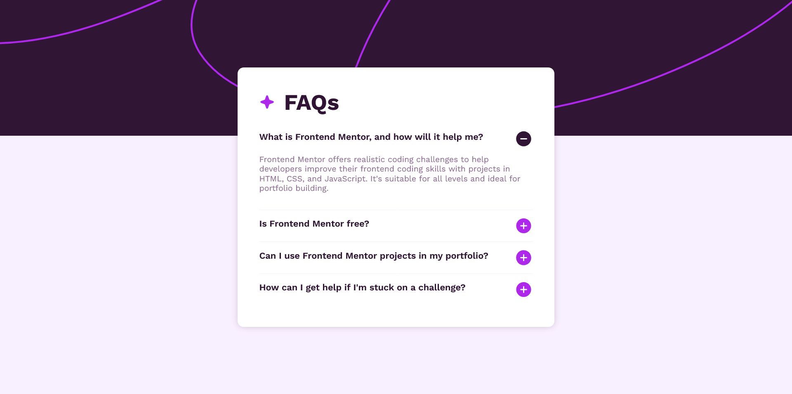
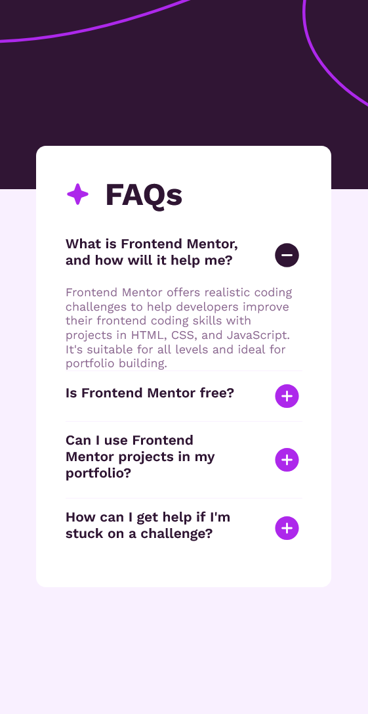

# Frontend Mentor - FAQ accordion solution

This is a solution to the [FAQ accordion challenge on Frontend Mentor](https://www.frontendmentor.io/challenges/faq-accordion-wyfFdeBwBz).

## Table of contents

- [Overview](#overview)
  - [Screenshot](#screenshot)
  - [Links](#links)
- [My process](#my-process)
  - [Built with](#built-with)
- [Author](#author)

## Overview

### Screenshots

Desktop version:

Mobile version:

### Links

- Solution URL: (https://www.frontendmentor.io/solutions/faq-accordion-3tKNtdI-M6)
- Live Site URL: [PinelopiRomeou](https://pinelopi-romeou.netlify.app)

## My process

### Built with

- Semantic HTML5 markup
- CSS custom properties
- Flexbox
- Mobile-first workflow
- JavaScript

## Author

- Website - [PinelopiRomeou](https://pinelopi-romeou.netlify.app)
- Frontend Mentor - [Pinelopi-Romeou](https://www.frontendmentor.io/profile/Pinelopi-Romeou)
- GitHub - [Pinelopi-Romeou](https://github.com/Pinelopi-Romeou)